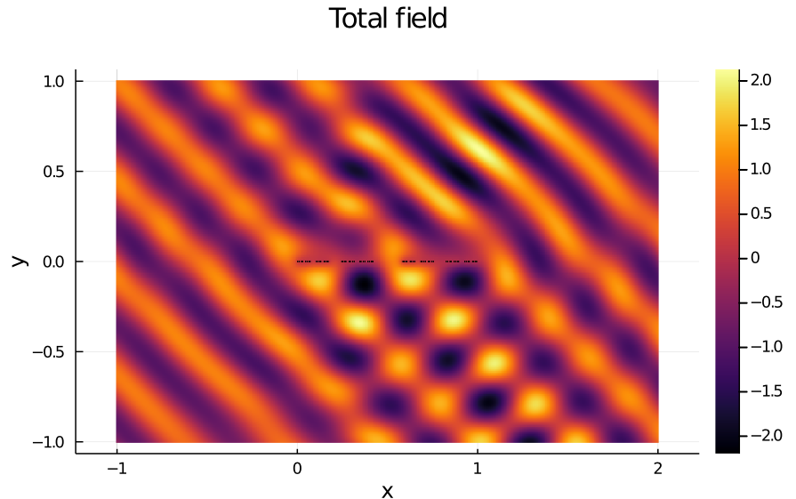

# HausdorffBEM

A suite of Boundary element methods (BEMs) designed for scattering by subsets of a screen (in two or three dimensions), which can be described by iterated function systems. Notebook examples demonstrate Cantor sets, Cantor dust, Galerkin and collocation BEM.

This code was written in collaboration with Andrea Moiola at University of Pavia, Italy.
